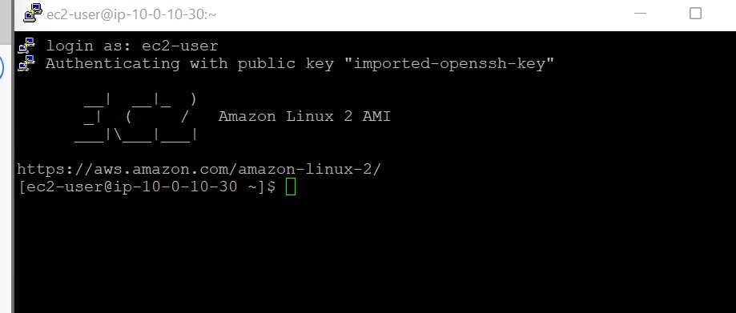
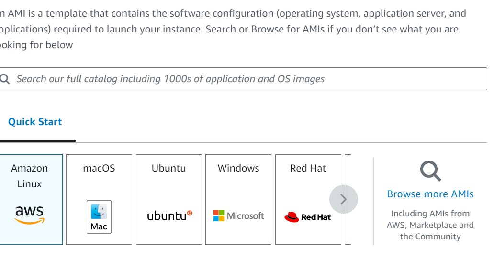
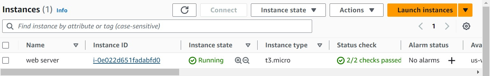
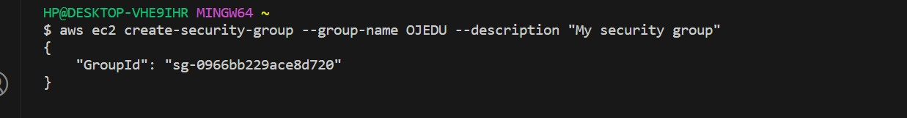

# launching an EC2 instance

in this guild, i will walk you through the method of lauching an ec2 instance on AWS

## prerequsite 
-AWS account
-access to AWS management console

### steps
1 **login to AWS management console:** 
   - Go to [AWS Management Console](https://aws.amazon.com/console/).
   - Sign in with your AWS credentials.
   

2 **Navigate to EC2 Dashboard:**
   - Click on the "Services" dropdown.
   - Select "EC2" under "Compute."

3 **Launch an EC2 Instance:**
   - Click "Launch Instance" button.
   - Choose an Amazon Machine Image (AMI).

   - Select an Instance Type.

   - Configure Instance Details.
   - Add Storage, Tags, and Security Groups.

   - Review the configurations and click "Launch."

4  **Accessing Your EC2 Instance:**
   - Retrieve the public IP address or DNS of your instance.
   - Connect to your instance using SSH or any other preferred method.

## Conclusion
Congratulations! You have successfully launched an EC2 instance on AWS.

